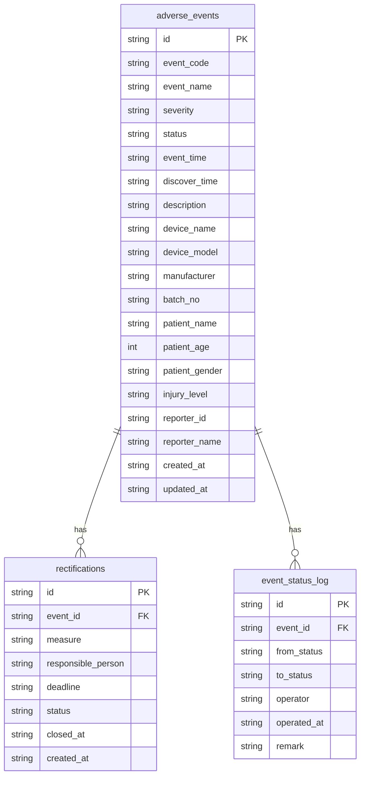

## 1. 架构设计

```mermaid
flowchart TB
    subgraph "前端层"
        "React@18" --- "React Router" --- "Zustand" --- "TailwindCSS"
    end
    subgraph "后端层"
        "Express@4" --- "路由中间件" --- "业务逻辑Service" --- "数据校验"
    end
    subgraph "数据层"
        "SQLite" --- "better-sqlite3"
    end
    "前端层" -- "REST API" --> "后端层"
    "后端层" -- "SQL" --> "数据层"
```

## 2. 技术说明

- 前端：React@18 + TailwindCSS@3 + Vite + Zustand
- 初始化工具：vite-init
- 后端：Express@4 + TypeScript (ESM)
- 数据库：SQLite (better-sqlite3)，零配置嵌入式数据库
- 认证：基于角色的简单 Token 认证（演示用）

## 3. 路由定义

| 路由 | 用途 |
|------|------|
| `/` | 事件列表页，展示所有不良事件 |
| `/events/new` | 事件登记页，新增不良事件 |
| `/events/:id` | 事件详情页，查看事件完整信息 |
| `/rectifications` | 整改跟踪页，管理整改任务 |

## 4. API 定义

### 4.1 事件 API

```typescript
interface AdverseEvent {
  id: string
  event_code: string
  event_name: string
  severity: "一般" | "严重" | "特别严重"
  status: "已登记" | "已上报" | "审核通过" | "审核驳回" | "整改中" | "已归档"
  event_time: string
  discover_time: string
  description: string
  device_name: string
  device_model: string
  manufacturer: string
  batch_no: string
  patient_name: string
  patient_age: number
  patient_gender: "男" | "女" | "未知"
  injury_level: "无" | "轻度" | "中度" | "重度" | "死亡"
  reporter_id: string
  reporter_name: string
  created_at: string
  updated_at: string
}

// GET /api/events - 事件列表（患者信息脱敏）
// GET /api/events/:id - 事件详情（患者信息脱敏，附带提示）
// POST /api/events - 新增事件（严重事件24小时校验）
// PUT /api/events/:id/status - 变更事件状态
// PUT /api/events/:id/archive - 归档事件（校验整改是否全部关闭）
```

### 4.2 整改 API

```typescript
interface Rectification {
  id: string
  event_id: string
  measure: string
  responsible_person: string
  deadline: string
  status: "待执行" | "执行中" | "已关闭"
  closed_at: string | null
  created_at: string
}

// GET /api/rectifications - 整改列表
// GET /api/rectifications/:id - 整改详情
// POST /api/rectifications - 新增整改任务
// PUT /api/rectifications/:id - 更新整改任务
// PUT /api/rectifications/:id/close - 关闭整改任务
```

### 4.3 系统 API

```typescript
// GET /api/health - 健康检查
// GET /api/stats - 统计数据
```

### 4.4 响应结构

```typescript
interface ApiResponse<T> {
  code: number
  message: string
  data: T
}

interface SeverityCheckResult {
  is_severe: boolean
  deadline: string | null
  hours_remaining: number | null
  warning_message: string | null
}

interface ArchiveCheckResult {
  can_archive: boolean
  open_rectifications: number
  warning_message: string | null
}
```

## 5. 服务端架构图

```mermaid
flowchart LR
    "Controller" --> "Service" --> "Repository" --> "SQLite"
```

- Controller：路由处理、参数校验、响应格式化
- Service：业务逻辑、状态机、脱敏、时限校验
- Repository：数据访问、SQL 执行

## 6. 数据模型

### 6.1 数据模型定义



### 6.2 数据定义语言

```sql
CREATE TABLE IF NOT EXISTS adverse_events (
  id TEXT PRIMARY KEY,
  event_code TEXT NOT NULL UNIQUE,
  event_name TEXT NOT NULL,
  severity TEXT NOT NULL CHECK(severity IN ('一般', '严重', '特别严重')),
  status TEXT NOT NULL DEFAULT '已登记' CHECK(status IN ('已登记', '已上报', '审核通过', '审核驳回', '整改中', '已归档')),
  event_time TEXT NOT NULL,
  discover_time TEXT NOT NULL,
  description TEXT NOT NULL,
  device_name TEXT NOT NULL,
  device_model TEXT NOT NULL,
  manufacturer TEXT NOT NULL,
  batch_no TEXT,
  patient_name TEXT,
  patient_age INTEGER,
  patient_gender TEXT CHECK(patient_gender IN ('男', '女', '未知')),
  injury_level TEXT NOT NULL CHECK(injury_level IN ('无', '轻度', '中度', '重度', '死亡')),
  reporter_id TEXT NOT NULL DEFAULT 'user001',
  reporter_name TEXT NOT NULL DEFAULT '上报员',
  created_at TEXT NOT NULL DEFAULT (datetime('now')),
  updated_at TEXT NOT NULL DEFAULT (datetime('now'))
);

CREATE TABLE IF NOT EXISTS rectifications (
  id TEXT PRIMARY KEY,
  event_id TEXT NOT NULL,
  measure TEXT NOT NULL,
  responsible_person TEXT NOT NULL,
  deadline TEXT NOT NULL,
  status TEXT NOT NULL DEFAULT '待执行' CHECK(status IN ('待执行', '执行中', '已关闭')),
  closed_at TEXT,
  created_at TEXT NOT NULL DEFAULT (datetime('now')),
  FOREIGN KEY (event_id) REFERENCES adverse_events(id)
);

CREATE TABLE IF NOT EXISTS event_status_log (
  id TEXT PRIMARY KEY,
  event_id TEXT NOT NULL,
  from_status TEXT,
  to_status TEXT NOT NULL,
  operator TEXT NOT NULL,
  operated_at TEXT NOT NULL DEFAULT (datetime('now')),
  remark TEXT,
  FOREIGN KEY (event_id) REFERENCES adverse_events(id)
);

CREATE INDEX idx_events_status ON adverse_events(status);
CREATE INDEX idx_events_severity ON adverse_events(severity);
CREATE INDEX idx_rectifications_event ON rectifications(event_id);
CREATE INDEX idx_status_log_event ON event_status_log(event_id);
```
